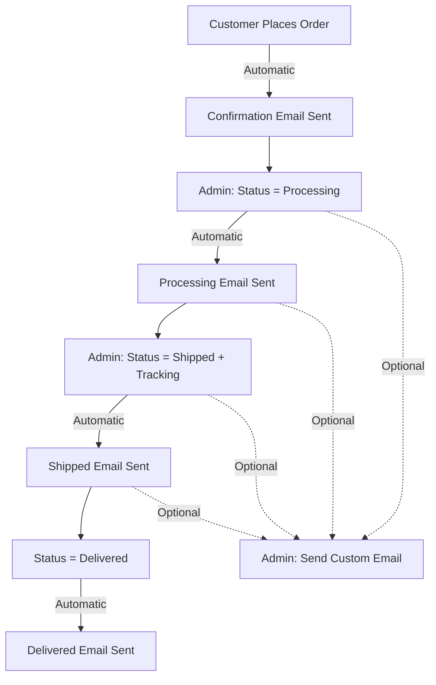

# Order Management System - Complete Guide

## 🎯 Overview

A comprehensive order management system with email automation for Sterren Verhalen. Admins have full control over orders, can communicate with customers, and automatic emails are sent at key stages.

---

## ✅ Features Implemented

### 1. **Admin Order Management Dashboard**

**Location**: Admin Panel → Orders Tab

**Features**:
- View all orders with customer details
- Click "View" button to open detailed modal
- See order status, amount, date at a glance
- Color-coded status indicators
- Customer information displayed inline

### 2. **Order Details Modal**

**Features**:
- ✏️ **Edit Order Status** - Change between pending, processing, shipped, delivered, cancelled
- 🚚 **Manage Tracking** - Add/edit tracking numbers
- 👤 **Customer Info** - Name, email, phone, order date
- 📍 **Shipping Address** - Full delivery address
- 📦 **Order Items** - Complete product list with quantities and prices
- 💰 **Order Total** - Full breakdown with totals
- 📧 **Send Custom Emails** - Communicate directly with customers

---

## 📧 Automated Email System

All emails sent from: **orders@sterrenverhalen.nl**

### Email Types:

#### 1. **Order Confirmation** (Automatic)
**Trigger**: When customer places an order  
**Subject**: Bedankt voor je bestelling! #ORD-123456  
**Content**:
- Order number and total
- Current status
- What happens next:
  1. Processing within 1-2 business days
  2. Shipping confirmation with tracking
  3. Delivery within 3-5 business days
- Link to track order in account

#### 2. **Status Update Notifications** (Automatic)
**Trigger**: When admin changes order status  
**Statuses that send emails**:
- **Processing**: "Your order is being processed and will be shipped soon"
- **Shipped**: "Your order has been shipped! Track & Trace: [number]"
- **Delivered**: "Your order has been delivered. We hope you enjoy it!"

#### 3. **Custom Messages** (Manual)
**Trigger**: Admin sends custom email via modal  
**Use Cases**:
- Answer customer questions
- Provide updates
- Handle special requests
- Resolve issues

---

## 🎨 How to Use

### For Admins:

#### **View Orders**:
1. Go to Admin Panel (shield icon in header)
2. Click "Orders" tab
3. See all orders in table format

#### **Manage Order**:
1. Click "View" button on any order
2. Modal opens with full details
3. Click "Edit" to modify status/tracking
4. Make changes
5. Click "Save"
6. ✅ Customer automatically receives email notification!

#### **Add Tracking Number**:
1. Open order modal
2. Click "Edit"
3. Enter tracking number
4. Change status to "Shipped"
5. Click "Save"
6. ✅ Customer receives email with tracking info!

#### **Send Custom Email**:
1. Open order modal
2. Scroll to "Email Customer" section
3. Enter subject
4. Type message
5. Click "Send Email"
6. ✅ Email sent immediately!

---

## 🔧 Backend API Endpoints

### Order Management:

```typescript
// Get all orders (admin only)
GET /api/orders?page=1&limit=20
Headers: Authorization: Bearer [token]

// Get specific order with full details
GET /api/orders/:id
Headers: Authorization: Bearer [token]
Response: {
  id, order_number, status, total_amount,
  email, first_name, last_name, phone,
  shipping_address, shipping_city, shipping_postal_code,
  items: [{ product_name, quantity, unit_price, total_price }]
}

// Update order status (sends email)
PATCH /api/orders/:id/status
Headers: Authorization: Bearer [token]
Body: {
  status: 'shipped',
  tracking_number: 'NL1234567890'
}

// Send custom email to customer
POST /api/orders/:id/send-email
Headers: Authorization: Bearer [token]
Body: {
  subject: 'Your custom subject',
  message: 'Your message to customer'
}

// Create order (sends confirmation email)
POST /api/orders
Headers: Authorization: Bearer [token]
Body: {
  items: [{ product_id, product_name, quantity, unit_price }],
  total_amount: 99.99,
  shipping_address, shipping_city, shipping_postal_code, shipping_country
}
```

---

## 📧 Email Configuration

### Brevo Setup:

1. **Verify Sender Email**:
   - Go to: https://app.brevo.com/senders
   - Add: `orders@sterrenverhalen.nl`
   - Verify via email

2. **Authenticate Domain**:
   - Go to: https://app.brevo.com/senders/domain
   - Add: `sterrenverhalen.nl`
   - Add DNS records (SPF, DKIM, DMARC)

3. **API Configuration** (Already done):
   - API Key: Set in `worker/wrangler.toml`
   - Sender: `orders@sterrenverhalen.nl`

---

## 🎯 Order Lifecycle & Emails



---

## 📊 Order Status Guide

| Status | Description | Email Sent? | Customer Action |
|--------|-------------|-------------|-----------------|
| **pending** | Order received, payment pending | ✅ Confirmation | Wait for processing |
| **processing** | Payment confirmed, preparing order | ✅ Processing Update | Wait for shipping |
| **shipped** | Order dispatched | ✅ Shipping + Tracking | Track package |
| **delivered** | Order received by customer | ✅ Delivery Confirmation | Enjoy! |
| **cancelled** | Order cancelled | ❌ (manual email only) | Refund processed |

---

## 🎨 UI Components

### Admin Orders Table:
- **Columns**: Order Number, Customer, Status, Amount, Date, Actions
- **Status Colors**:
  - 🟢 Green: Delivered
  - 🔵 Blue: Shipped/Processing
  - 🟡 Yellow: Pending
  - 🔴 Red: Cancelled
- **Actions**: "View" button per order

### Order Details Modal:
- **Header**: Order number + Status badge
- **Sections**:
  1. Customer Information (name, email, phone)
  2. Shipping Information (address, tracking)
  3. Order Items (table with products)
  4. Email Customer (form to send messages)
- **Edit Mode**: Toggle to modify status and tracking
- **Responsive**: Works on mobile and desktop

---

## 🔒 Security

- ✅ Admin-only endpoints (JWT authentication)
- ✅ Order ownership verified
- ✅ Email rate limiting via Brevo
- ✅ Input validation
- ✅ CORS protection

---

## 📝 Email Templates

### Confirmation Email Example:

```html
Subject: Bedankt voor je bestelling! #ORD-1734567890-1

Beste [Customer Name],

Bedankt voor je bestelling bij Sterren Verhalen!

Bestelgegevens:
- Bestelnummer: ORD-1734567890-1
- Status: in behandeling
- Totaalbedrag: €49.98

Wat gebeurt er nu?
1. We verwerken je bestelling binnen 1-2 werkdagen
2. Je ontvangt een verzendbevestiging met track & trace
3. Je bestelling wordt binnen 3-5 werkdagen bezorgd

Je kunt je bestelling volgen via je account op onze website.

Hartelijke groet,
Het Sterren Verhalen-team

Vragen over je bestelling?
Neem contact met ons op via orders@sterrenverhalen.nl
```

---

## 🚀 Deployment Checklist

- [x] Backend API deployed to Cloudflare Workers
- [x] Email templates implemented
- [x] Brevo API integration configured
- [x] Admin modal UI created
- [x] Order management integrated
- [ ] **TODO**: Verify `orders@sterrenverhalen.nl` in Brevo
- [ ] **TODO**: Push frontend to GitHub
- [ ] **TODO**: Test full order flow
- [ ] **TODO**: Authenticate domain for better deliverability

---

## 🧪 Testing

### Test Order Creation:
```bash
POST https://storybook-wonder-api.velkovaleksandar.workers.dev/api/orders
Headers: { Authorization: Bearer [your-token] }
Body: {
  "items": [
    {
      "product_id": "book-emma",
      "product_name": "The Adventures of Emma",
      "quantity": 2,
      "unit_price": 24.99
    }
  ],
  "total_amount": 49.98,
  "shipping_address": "Test Street 123",
  "shipping_city": "Amsterdam",
  "shipping_postal_code": "1012 AB",
  "shipping_country": "Nederland"
}
```

Expected: Order created + Confirmation email sent

### Test Status Update:
1. Go to Admin Panel
2. Open an order
3. Change status to "Shipped"
4. Add tracking number
5. Save

Expected: Status updated + Shipping email sent to customer

---

## 📞 Support

For issues or questions about the order management system:
- Backend: `worker/src/routes/orders.ts`
- Frontend: `src/pages/Admin.tsx` + `src/components/admin/OrderDetailsModal.tsx`
- Email Templates: In `orders.ts` (function `getOrderConfirmationEmail`)

---

## 🎉 Summary

✅ **Complete order lifecycle management**  
✅ **Automated email notifications**  
✅ **Manual customer communication**  
✅ **Beautiful admin interface**  
✅ **Real-time status updates**  
✅ **Tracking number support**  
✅ **Professional email templates**  

The order management system is ready for production! Just verify the sender email in Brevo and deploy! 🚀


